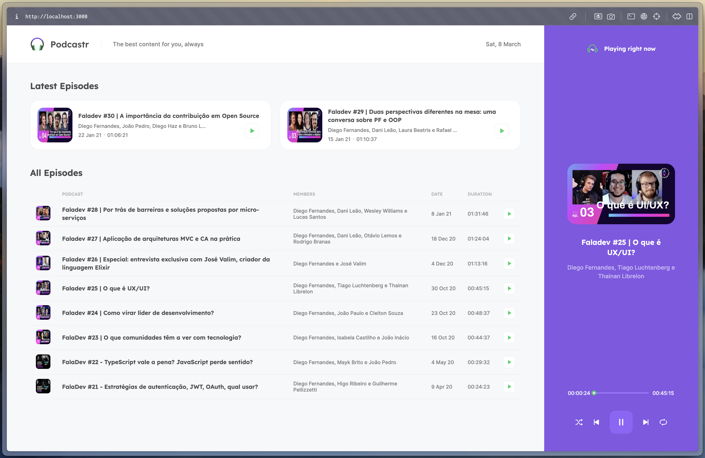

# Podcastr

A web application built to explore and demonstrate modern web development technologies such as React, Next.js, TypeScript, and the Web Audio API. The project implements a podcast streaming platform with features like audio playback control, playlist management, and a responsive user interface.

<div align="center">
  
</div>

## Features

- 🎧 Stream podcasts directly in the browser
- 📱 Responsive design for all devices
- ⏯️ Full playback control (play, pause, next, previous)
- 🔄 Shuffle and repeat modes
- 🎨 Modern and intuitive interface
- 📊 Progress tracking for episodes

## Tech Stack

- **Frontend Framework**: [Next.js](https://nextjs.org/) - React framework for production
- **Language**: [TypeScript](https://www.typescriptlang.org/) - For type safety and better developer experience
- **Styling**: [Sass](https://sass-lang.com/) - For enhanced CSS capabilities
- **State Management**: React Context API - For managing global application state
- **Audio Player**: Custom built with Web Audio API
- **HTTP Client**: [Axios](https://axios-http.com/) - For making HTTP requests

## Getting Started

### Prerequisites

- [Node.js](https://nodejs.org/en/) (v14 or higher)
- [Yarn](https://yarnpkg.com/) package manager

### Installation

1. Clone the repository:
```bash
git clone https://github.com/rribeiro1/podcastr.git
cd podcastr
```

2. Install dependencies:
```bash
yarn install
```

3. Start the development server:
```bash
# Run the backend (fake server)
yarn server

# In a new terminal, run the web application
yarn dev
```

4. Open [http://localhost:3000](http://localhost:3000) in your browser

## Development

### Available Scripts

- `yarn dev` - Runs the app in development mode
- `yarn build` - Builds the app for production
- `yarn start` - Runs the built app in production mode
- `yarn server` - Runs the mock API server

### Project Structure

```
podcastr/
├── src/
│   ├── components/     # Reusable UI components
│   ├── contexts/      # React Context providers
│   ├── pages/         # Next.js pages
│   ├── services/      # API services
│   ├── styles/        # Global styles and CSS modules
│   └── utils/         # Utility functions
├── public/            # Static files
└── server.json        # Mock API data
```

## Contributing

1. Fork the repository
2. Create your feature branch (`git checkout -b feature/amazing-feature`)
3. Commit your changes (`git commit -m 'feat: add amazing feature'`)
4. Push to the branch (`git push origin feature/amazing-feature`)
5. Open a Pull Request
